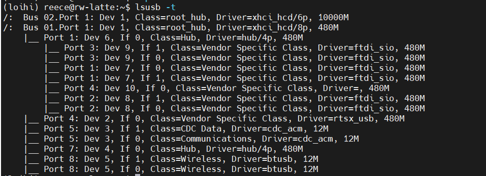
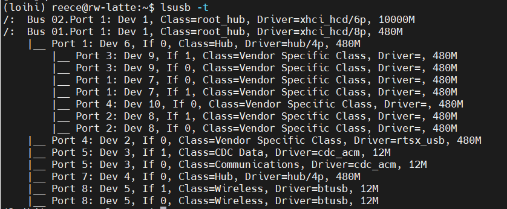
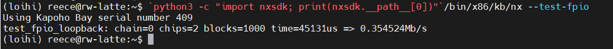
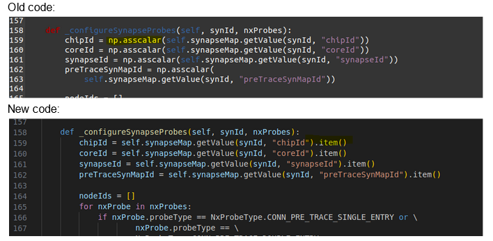

# LattePanda Delta 3 Setup

This document outlines the setup steps required for the Latte Panda to interface with the KB board. You will find links to useful resources to walk you through step by step, as well as bash scripts to help with daily setup and repetitive command line tasks.


## Installing Ubuntu (Linux) on the LattePanda 

- <u>Requirements</u>: Empty USB with at least 8 GB.  

- Follow the official LattePanda documentation found [here](http://docs.lattepanda.com/content/3rd_delta_edition/Operating_Systems_Ubuntu/) on how to install Ubuntu 22.04

    - (Optional) When choosing the install type you can erase disk and install Ubuntu if you want; this will remove the pre-installed windows OS. 


## Setup Git/Github 

- The repository for this project is found [here](https://github.com/Agile-and-Adaptive-Robotics/panda-kb-pipeline)

```bash
git clone https://github.com/Agile-and-Adaptive-Robotics/panda-kb-pipeline
```

## Setup SSH & File Sharing
Connecting to the Latte via SSH so you can develop with a headless setup. This will be important when you are programming and testing the board - a headless setup will help us increase performance of the board. <u>Note</u> that I am using MobaXterm to connect via SSH on the client machine (i.e. my laptop or some other device).  

- Run the following commands from the command line on the Panda: 
```bash
sudo apt update 
sudo apt install openssh-server -y

# Check that your SSH server is running with
sudo systemctl status ssh

#Get the IP address and write it down
ip a 
```
- Once you have the IP and the SSH server is running you can connect using your computer. 

```bash
ssh username@server_ip
```

- If you don't what to remember the IP address, you can setup an Alias. I leave it to you to figure this out depending on the software you're using. 

- Lastly, you will need to use the `tmux` tool to be able to open multiple terminals over a single SSH session

```bash
sudo apt update && sudo apt install tmux -y

# To start a new session
tmux new -s session name
```
Once inside a tmux session, below are the general commands to use this tool: <br>
    - Creating a New Window: Ctrl-b then c <br>
    - Switching Between Windows: Ctrl-b then n (for next window) or Ctrl-b then p (for previous window) <br>
    - Splitting the Window Vertically: Ctrl-b then % <br>
    - Splitting the Window Horizontally: Ctrl-b then " <br>
    - Switching Between Panes: Ctrl-b then use the arrow keys <br>
    - Closing a Pane: Exit the shell in that pane (usually by typing exit or pressing Ctrl-d) <br>
    - Detach from tmux Session: Ctrl-b then d <br>

### Setup filesharing using SAMBA

- Run these on the Panda or from an SSH connection
```bash
sudo apt update
sudo apt install samba

#Backup config file
sudo cp /etc/samba/smb.conf /etc/samba/smb.conf.backup

#Edit Config File
sudo nano /etc/samba/smb.conf
#Scroll to end of file and add these fields
#You can share whatever path you'd like, I chose my home directory /home/reece
[ShareName] #Whatever you want to name it
path = /path/to/your/share
available = yes
valid users = your_username
read only = no
browsable = yes
public = yes
writable = yes

#Create samba user
sudo smbpasswd -a username

#restart samba to apply changes
sudo systemctl restart smbd
sudo systemctl restart nmbd
```

- Now on your client machine access the shared drive

    If using a windows computer follow these steps: 
    - Open File Explorer, in the address bar of File Explorer, type `\\Ubuntu_machine_IP\ShareName` and press Enter. <br>
    - Replace Ubuntu_machine_IP with the IP address of your Ubuntu machine and ShareName with the name of your share you set up in the Samba configuration.
    - If prompted, enter the Samba username and password you set up on the Ubuntu machine.
    Map Network Drive (Optional): 
    <br>
    - If you want the shared folder to appear as a drive in My Computer, right-click on the folder and select "Map network drive..."
    - Follow the prompts to assign a drive letter to the shared folder.

## Copy the NxSDK package to your Ubuntu OS
A copy of NxSDK 1.0.0 is available in the lab’s Drive folder at
- `PROJ-Agile_Adaptive_Robotics > Projects > Kapoho Bay > NxSDK > 1.0.0`

Download this folder, then copy
`nxsdk.1.0.0.tar.gz` 
`nxsdk-apps-1.0.0.tar.gz` 
to the `Panda's` home directory `/home/<user>`. The tarballs will likely be restricted and might not show up on a simple ls command. You can see it, as well as its permissions, with ls -la . Access can be changed in bash using the chmod command*:
```
chmod 777 nxsdk-1.0.0.tar.gz

chmod 777 nxsdk-apps-1.0.0.tar.gz
```
In the lab drive’s NxSDK folder, there is also a file named “nxsdk-docs-v095.exe”. Download this file onto your computer. When executed, it opens Intel’s NxSDK documentation, which contains useful information about programming the Loihi. You don't need to install this onto the LattePanda, but need it for reference to learn about the software development kit (SDK).

## Install Anaconda 

- You will need the GUI desktop for this step
- Login to the LattePanda and go [here](https://www.anaconda.com/download) for the Anaconda installer -> Downlaod the x86 Linux Installer

Once downloaded
```bash
cd ~/Downloads
chmod +x Anaconda3-YYYY.MM-Linux-x86_64.sh
#Execute the installer and follow the prompts
./Anaconda3-YYYY.MM-Linux-x86_64.sh
#Restart your shell and update conda
conda update -n base -c defaults conda
#Check installation
conda --version
```


## Create the Python Virtual Environment and Install the NxSDK 
- As prerequisite you will need the gcc tool-chain installed on the Panda. If it is not installed run the following commands: 
```bash
sudo apt install build-essential
sudo apt-get install gcc python3-dev
```
- Create a Virtual Environment (VE)
    - Note that all python packages and dependencies should be installed within the VE
```bash
conda create -n “loihi” python=3.7
```


- Next you will install the NxSDK; the following steps come directly from the NxSDK documentation. This can be accessed by launching the nxsdk-docs-v095 application. The directions for this step are found at **Getting Started->Getting Started with KapohoBay->Installing and Running NxSDK on KapohoBay** (KB).

- Do all of the following steps within the virtual environment. You know that your VE is activate when your terminal prompt changes - it should have the prefix of your VE name (i.e. "loihi")

    - Activate the VE -> `conda activate loihi`
    - Go to your home directory and install the nxsdk (this may take up to 10 minutes to complete): 
    ```bash
    cd ~
    pip install nxsdk-1.0.0.tar.gz 
    ```
    -Check that the installation was successful, it should look like that below
    ```bash
    (loihi) reece@rw-latte:~$ python -c "import nxsdk; print(nxsdk.__version__)"
    1.0.0
    (loihi) reece@rw-latte:~$ python -c "import nxsdk; print(nxsdk.__path__)"
    ['/home/reece/anaconda3/envs/loihi/lib/python3.7/site-packages/nxsdk']
    ```
    - If the installation didn't work, read the logs and figure out what when wrong. You may need to take additional steps. If you followed all directions correctly Anaconda should be able to install the NxSDK and handle dependencies without any troubles.


## Unzip Tutorials, and Setup udev rules for Kapoho Bay
```bash
mkdir nxsdk-apps
tar xzf nxsdk-apps-1.0.0.tar.gz -C nxsdk-apps --strip-components 1
#Some modules require additional dependencies, good idea to install these
sudo apt install pkg-config
conda install cython=0.29.22
conda install h5py
pip install -r nxsdk-apps/nxsdk_modules/requirements.txt
```

- Next Copy 99-kapoho_bay.rules
```bash
sudo cp nxsdk-apps/utils/99-kapoho_bay.rules /etc/udev/rules.d
sudo udevadm control --reload

#confirm the transfer by running the following
ls -lha /etc/udev/rules.d
#output should look like this
total 96K
drwxr-xr-x 2 root root 4.0K Mar 20 16:17 .
drwxr-xr-x 4 root root 4.0K Feb 20 11:22 ..
-rw-r--r-- 1 root root  12K Mar 20 09:34 70-snap.firefox.rules
-rw-r--r-- 1 root root 1.7K Feb 20 11:28 70-snap.snapd-desktop-integration.rules
-rw-r--r-- 1 root root  62K Feb 20 11:28 70-snap.snapd.rules
-rw-r--r-- 1 root root 3.8K Feb 20 11:28 70-snap.snap-store.rules
-rw-r--r-- 1 root root  255 Mar 20 16:17 99-kapoho_bay.rules
```
### Install additional packages
```bash
sudo apt-get update
sudo apt-get install g++-multilib
sudo apt-get install libgflags-dev
sudo apt install libgoogle-glog-dev
# Install libprotobuf17 from Debian
wget http://ftp.debian.org/debian/pool/main/p/protobuf/libprotobuf17_3.6.1.3-2_amd64.deb
sudo dpkg -i libprotobuf17_3.6.1.3-2_amd64.deb
#tell apt to resolve missing dependencies
sudo apt -f install 
```

## Test KapohoBay Connection
Plug in the the KB Board
```bash
export KAPOHOBAY=1
lsusb -t
```

`lsusb -t` should output the below: 


Disable the default device driver with `sudo rmmod ftdi_sio`

Now when `lsusb -t` is run, the output should look like this: 



Now verify the Loihi connection, run: 
```bash
python -c "import nxsdk; print(nxsdk.__path__)"
cd [path returned from previous command]
`python3 -c "import nxsdk; print(nxsdk.__path__[0])"`/bin/x86/kb/nx --test-fpio
#If you have problems with the above command, with error 'libi2c.so.0 cannot open`

sudo apt install plocate
sudo apt-get update
sudo apt-get install libi2c-dev i2c-tools
sudo apt-get install libgrpc++-dev
sudo updatedb
#Now run the locate utility and you should see libi2c.so.0 directory
locate libi2c.so.0
```

After running the ``python3 -c "import nxsdk; print(nxsdk.__path__[0])"`/bin/x86/kb/nx --test-fpio` command you should get this output


## Run NxSDK Tutorial for testing setup

Make sure to plug in device, deactivate `ftdi_sio` driver as shown previously, testing loihi connection, and run tutorials within the "loihi" virtual environment

```bash
#navigate to the nxsdk-apps/tutorial directory and run any tutorial for testing
#example 
python tutorial_01_single_compartment_with_bias.py
```

When first running tutorials you will encounter several errors which you will need to resolve because of outdated dependencies and source files we don't have access to. Below are errors that I encountered and their solution. 

1) [ERROR]
```bash
- If this call came from a _pb2.py file, your generated code is out of date and must be regenerated with protoc >= 3.19.0.
If you cannot immediately regenerate your protos, some other possible workarounds are:
 1. Downgrade the protobuf package to 3.20.x or lower.
 2. Set PROTOCOL_BUFFERS_PYTHON_IMPLEMENTATION=python (but this will use pure-Python parsing and will be much slower).
```
**Solution:** as the work around suggest install protobuf 3.20.1
`conda install protobuf=3.20.1` 

2) [ERROR] **This error does not occur if you are using python=3.7**
```bash
File "/home/reece/anaconda3/envs/loihi/lib/python3.7/site-packages/nxsdk/compiler/nxsdkcompiler/n2_connections_mapper.py", line 206, in map
    N2_CONSTANTS.N2_COMPILER_INVALID_VALUE, dtype=np.int)
  File "/home/reece/anaconda3/envs/loihi/lib/python3.9/site-packages/numpy/__init__.py", line 324, in __getattr__
    raise AttributeError(__former_attrs__[attr])
AttributeError: module 'numpy' has no attribute 'int'.
`np.int` was a deprecated alias for the builtin `int`. To avoid this error in existing code, use `int` by itself. Doing this will not modify any behavior and is safe. When replacing `np.int`, you may wish to use e.g. `np.int64` or `np.int32` to specify the precision. If you wish to review your current use, check the release note link for additional information.

```
**Solution:** Go the the file `n2_connections_mapper.py` line `206` which is causing this error and edit `dtype=np.int` to `dtype=int`, save and run again. 

3) [ERROR] **This error does not occur if you are using python=3.7**
```bash
File "/home/reece/anaconda3/envs/loihi/lib/python3.9/site-packages/nxsdk/compiler/nxsdkcompiler/n2_probes_compiler.py", line 187, in _configureCompartmentProbes
    chipId = np.asscalar(self.compartmentMap.getValue(cxNodeId, "chipId"))
  File "/home/reece/anaconda3/envs/loihi/lib/python3.9/site-packages/numpy/__init__.py", line 333, in __getattr__
    raise AttributeError("module {!r} has no attribute "
AttributeError: module 'numpy' has no attribute 'asscalar'
(loihi) reece@rw-latte:~/nxsdk-apps/tutorials/nxnet$
```

**Solution:** This error actually involves several instances of attribtue `asscalar`. Go to the file `n2_probes_compiler.py` and edit the code as shown below. In this file the errors are on lines `159-162` and `186-188`.



4) [ERROR]
```bash
(loihi) reece@rw-latte:~/nxsdk-apps/tutorials/nxnet$ python tutorial_01_single_compartment_with_bias.py
INFO:HST:  /home/reece/anaconda3/envs/loihi/lib/python3.9/site-packages/nxsdk/driver/../bin/x86/kb/nx_driver_server: symbol lookup error: /home/reece/anaconda3/envs/loihi/lib/python3.9/site-packages/nxsdk/driver/../bin/x86/kb/nx_driver_server: undefined symbol: _ZN4grpc13ServerBuilderC1Ev
WARNING:NET:  Received Signal: 2. Kill Subprocess PID: 4491
INFO:DRV:      Host server up..............Done 8.47s
INFO:DRV:  Executor: 100 timesteps.........Done 8.47s
(loihi) reece@rw-latte:~/nxsdk-apps/tutorials/nxnet$
```

**Solution:** To resolve this was a days long process and required several steps which I will walk through below.
- Add Focal Repository to Your System (note the ubuntu release I'm using is jammy) you should have to do this if you're using focal
These steps are called apt pinning, [here is a how to](https://help.ubuntu.com/community/PinningHowto) if you'd like to learn more.
```bash
sudo nano /etc/apt/sources.list.d/focal.list
#Inside this file put these lines of text then save
deb http://archive.ubuntu.com/ubuntu/ focal main universe
deb-src http://archive.ubuntu.com/ubuntu/ focal main universe

#Setup pinning perferences
sudo nano /etc/apt/preferences.d/focal-pin
#inside this file put these lines of text then save
Package: *
Pin: release n=jammy
Pin-Priority: 500

Package: *
Pin: release n=focal
Pin-Priority: 100

#Prioritize Focal packages for libgrpc**
sudo nano /etc/apt/preferences.d/grpc
#inside this file put these lines of text then save
Package: libgrpc++-dev libgrpc-dev libgrpc++1 libgrpc6
Pin: release n=focal
Pin-Priority: 1001

#update package list 
sudo apt update

#force install specific version required by NxSDK Tutorials / KB Board
sudo apt-get install libgrpc++-dev=1.16.1-1ubuntu5 libgrpc-dev=1.16.1-1ubuntu5 libgrpc++1=1.16.1-1ubuntu5 libgrpc6=1.16.1-1ubuntu5

#check that the right packages are installed
dpkg -l | grep grpc

#make sure no other packages have been broken
sudo apt --fix-broken install

#inside your VE
conda install grpcio

```

**Side Note**
- When dealing with undefined symbols use this: `c++filt _ZN4grpc13ServerBuilderC1Ev`, it's helpful for debugging
```bash 
grpc::ServerBuilder::ServerBuilder()
```

