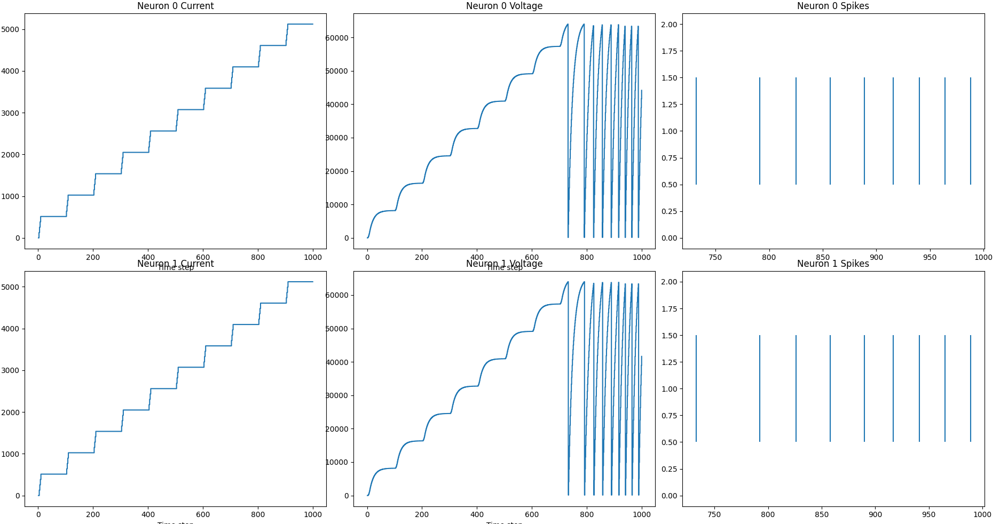
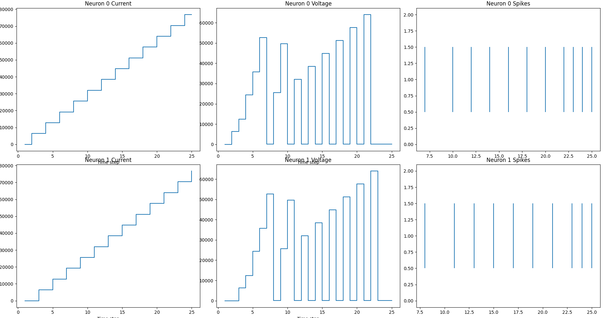

# Dummy Pipeline 1.0:
This project is dedicated to setting up the basic framework on how our hardware devices will talk to each other 
- Eventually the quadruped will be setup with this data pipeline: **BioFeedback** --->**Teensy** ---[SPI]---> **Panda** ---[USB]---> **Loihi (KB)**   
- In future iterations we will be using biofeedback sensors in place of the oscillator module found here. We have a student working on a strain gauge sensor from Liquid Wire that is supposed to provide us real-time length sensing. 

## Design Steps: 
1. Setup Teensy Board with oscillator.cpp program, and determine callback method to receive spike train
2. Create UART connection between Teensy & Panda Board
3. Define loihi network- In this case its a simple two neuron setup. Nothing special except they receive spikes and send out spikes vis channels. 
4. Create Host SNIPs on Loihi for Data Exchange between Panda and KB

# 1. Setting up Teensy Board: 
- See `teensy/` subdirectory for this work

# 2. Create UART Connection between Teensy & Panda Board
- Note that the Panda Board has an Arduino Leonardo AVR coprocessor. The LattePanda and Arduino are connected via a serial port which is accessible through the system driver `/dev/ttyACM0`
- Setting up arduino processor is managed by the `arduino_manager.py` script. By using arduino CLI tools the main.py script is able to run and upload `/arduino/arduino.ino` code to the AVR chip.

# 3. Define Loihi Network
- The eventual goal is to work towards creating and defining an oscillating neural network, this iterations uses a simple two neuron setup as a test pipeline to setup connections between the Teensy and Arduino MCUs. 
- See `main.py` and `loihi_utils.py` for network setup. 

# 4. Programming SNIPs
- In the test program `/tests/oscillator` I quickly realized the limitations of using SpikeGenerator and Receivers- they aren't appropriate for real time performance. The reason I used them was to keep things simple and get myself working with the NxSDK as much as possible. 
- My snips are based on the framework that Stu pointed me to which can be found on combra-lab's github [spiking-oculomotor-head-control](https://github.com/combra-lab/spiking-oculomotor-head-control). 

- Within this dummy pipeline, I implement encoder and decoder in separate threads using pythons threading library. This allows the two to execute in parallel. It's important that the two are in separate and asynchronous threads as the, communication channels and the SNIPs they interface with, are asynchronous. Additionally, calls to read and write from channels are blocking so it's important to handle each separately to avoid deadlock and slowing down either process. Lastly, be sure to call the probe methods to ensure channels are available. If you try reading or writing to a channel that is not available these calls will block and a deadlock will likely result. 


# Side Notes: 
### Encoding Ideas
See this article for spike encoding [SNNTorch](https://snntorch.readthedocs.io/en/latest/tutorials/tutorial_1.html)

### UART Communication Considerations:
- At this time, I'm using a one to one point communication via UART. Of course, this poses issues since we have four Teensy boards that need to communicate with the LattePanda. Future iterations will need to consider using the Arduino Library `SoftwareSerial.h`. The software implementation introduces more latency, and we might need to consider I2C. 

### Comparison of I2C and UART
- Below are the considerations of both the LattePanda and Teensy and how they would work together

**Trade offs**  
For Real-Time Applications:
   -  UART is generally better for real-time applications that require low latency, simplicity, and point-to-point communication. It is more deterministic and has less overhead, making it suitable for applications where quick and reliable data transfer between two devices is critical.
   -  I2C can be used in real-time applications where multiple devices need to communicate on the same bus, but it requires careful management of bus contention and potential latency issues. It is less suited for high-speed real-time communication due to its inherent complexities and potential for higher latency.

**I2C**  
- Teensy 4.1 supports up to 1000 kbits/sec
- The LattePanda's ATmega32u4 MCU only supports speeds up to 400 kbits/sec
- Half Duplex which greatly reduces throughput

**UART**
- Full Duplex and generally better for lower latency point to point communication
- Both device say they support high speed  baud rates, but don't specify a maximum. 
 - Generally, high speed rates are considered to be 230400, 460800, and 921600 bps. 
- UART is generally for point-to-point communication but it could be designed in software to support a sort of daisy chain configuration so that we can connect all four teensys on a single bus. The issue is that the LattePanda only has one UART port. 


### Next steps and things to test: 
**Conclusion**: The following conclusion needs more testing. The Loihi board runs much too fast when probes are disabled, so how can we slow this down so our pipeline is still useable. 
1. Do Loihi Value reset after each run ? 
 - Example: nxnet/tutorial-25 will be helpful for this...

For my test I performed the simple loop and it was confirmed that the board does not reset after each run. See below: 
```python
#code 
board.start()
    #encoder_thr.start()
    #decoder_thr.start()
    #serial_thr.start()
    try:
        neuronid = 0
        for i in range(10):
            board.run(100, aSync = True)
            for i in range (8):
                encoderChannel.write(1, [neuronid])
                neuronid = 1 - neuronid
            while(decoderChannel.probe()):
                data = decoderChannel.read(1)
                #print(data)
            board.finishRun()

```


2. Can you throttle down the fpga by managing timesteps with SNIPs? 
I tested this question with the below code. **IN conclusion** throttling or blocking the execution of the loihi can be done through busy waiting. 
```python
# in the python code
try:
        neuronid = 0
        board.run(25, aSync = True)
        for i in range(25):
            encoderChannel.write(1, [neuronid])
            neuronid = 1 - neuronid
            if(decoderChannel.probe()):
                data = decoderChannel.read(1)
                print(f"Neuron {data} fired")
            time.sleep(0.5)
        board.finishRun()
```
```c
//SNIP Code: 
static int time= 0; // Global time variable
static int chip = 0;
static int core = 0; 
static int axon;
static int channelId = -1; // Encoder channel ID

int do_encoding(runState *s){
    if((s->time_step >= 0) & (channelId = -1)){
        // Get the channel ID of the encoder
        channelId = getChannelID("nxEncoder");
    }
    if(channelId == -1){
        printf("Error: Could not find encoder channel\n");
        return 0;
    }
    while(!probeChannel(channelId)){
        // Wait for the encoder channel to have data
        //test to throttle pipeline
    }
    return 1;
}

void run_encoding(runState *s){
    //printf("Running spiking process\n"); // Debugging
    time = s->time_step;
    readChannel(channelId, &axon, 1);
    //printf("Read channel axonId %d\n", axon); // Debugging
    uint16_t axonId = 1 << 14 | (axon & 0x3FFF);
    ChipId chipId = nx_nth_chipid(chip);
    printf("Sending spike at time : %d, axonId %d\n", time, axonId);

    //send spike
    nx_send_remote_event(time, chipId, (CoreId){.id=4+core}, axonId);
}

```
### Results 
